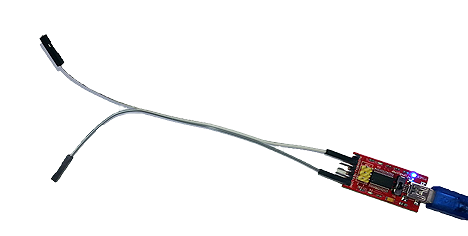
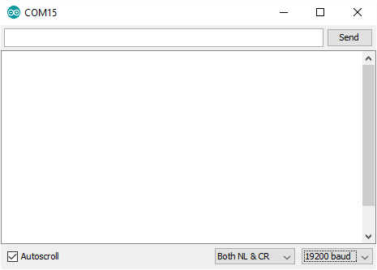
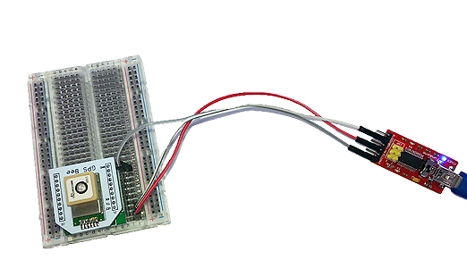
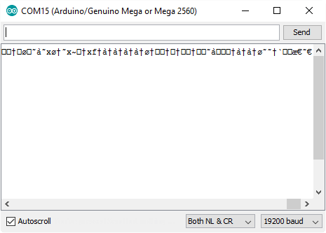
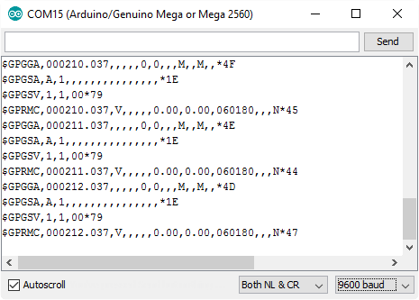
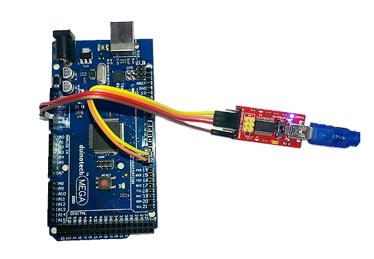
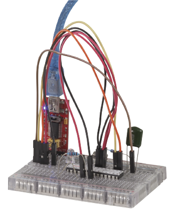
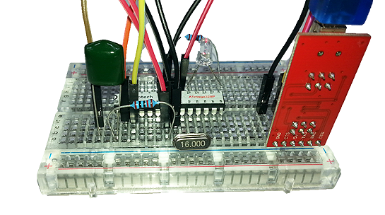

# Arduino Tool: USB-Serial Converter

We usually think of tools as something that we use to get hardware built and working. If you're more of a software person, then a USB Serial Converter is a good tool to have in your collection. In this guide, we'll be using the [XC4464 Arduino Compatible USB-Serial Converter](https://jaycar.com.au/p/XC4464) , as it provides 5V TTL level signals which Arduino boards use. There are some variants which use the so-called RS-232 level signals (which are typically +12V to -12V, and may even damage 5V equipment), such as the[XC4834](https://jaycar.com.au/p/XC4834) . These are commonly seen on some industrial equipment and dial-up modems, but we won't be we won't look at these in this guide, although you could use some of these techniques if you are working with this equipment.

Some of the things you can do with a USB-Serial Converter include debugging and decoding serial data streams, programming an Arduino, programming the [XC4614 Wifi Shield](https://jaycar.com.au/p/XC4614) to act as a standalone Arduino board (see[this download](https://www.jaycar.com.au/medias/sys_master/images/8936207253534/XC4614-firmwareMain.zip) for more information) and even creating a stand-alone Arduino.

For most of these tasks, a set of [WC6028 Plug-Socket Jumper Leads](https://jaycar.com.au/p/WC6028) will be handy for hooking things up, and even a breadboard can be handy for managing connections.

## Getting started with XC4464

A brief guide to the [XC4464 can be found here](https://www.jaycar.com.au/medias/sys_master/images/8936225112094/XC4464-manualMain.pdf) , but if you have the Arduino IDE installed, then you have drivers (it uses the same drivers and IC as the Nano board) and a serial terminal program (the Serial Monitor) installed. We're going to work with the Arduino Serial Monitor for these guides. There are other programs out there, and their settings might be different.

The important thing to know is the name or number of the serial port that has been allocated to the USB-Serial converter. Under Windows, open Device Manager, and look for COM ports under Ports (COM & LPT). If there's more than one, you can try unplugging and replugging the converter, to see which one disappears and reappears- this is more than likely the correct port.

You can also look in the Arduino IDE under the Tools>Port> menu option, to see what ports are available and try them.

## Debugging and Decoding Serial Streams

If you just want to read and monitor a serial data stream, you only need two connections- a ground connection for reference (GND pin), and a wire on the receive (RXD) pin for the signal:

Open the Arduino IDE, and select the name or number of your USB-Serial Converter, then click Tools>Serial Monitor:

One important parameter for any Serial Data stream is the Baud rate, and as you can see, this is set by the box in the bottom right corner of the window. If you know what the baud rate is, you can set this now, otherwise, you might need to connect the USB-Serial Converter to your data source, and try different Baud rates until one returns meaningful data.

We're going to hook our USB-Serial Converter up to a GPS Module to demonstrate. In this case, we can also use the 5V pin on the USB-Serial Converter to power the GPS Module:

The pin for data coming out of a device might be marked TX (as in this case).

When we have this connected up, we see the following on the Serial Monitor:

This doesn't look like the 'nice' data we are expecting, so the first thing we try is a different Baud rate. When we change to 9600, this is what we see:

Which we know looks like valid GPS data. You could also use such a setup to test if the data is being transmitted properly, or if some data is being corrupted or dropped, for example if serial data between an Arduino main board and shield is being getting through correctly.

## Programming an Arduino Board

Given that most Arduino Main boards have a USB-Serial Converter built-in, there's usually not much need for this trick. But if there is a problem with the USB-Converter IC on the board, this is a good way to get some more use out of it. This method will only work with Uno, Mega and Nano boards, as the Leonardo and Lilypad boards have the USB function built in to the main chip, so it cannot be bypassed.

Make the following connections:

|USB-Serial Converter|Arduino Main Board
|---|---
|5V|5V
|GND|GND
|TXD|RX0(D0)
|RXD|TX1(D1)
Note that TX on one board goes to RX on the other board- this is typical for serial communication, and can sometimes be a source of confusion. In the example below, we've connected a Mega board. Note that the Mega board is drawing its power through the USB-Serial Converter.

From here, select the Serial Port of the USB-Serial Converter, and select the main board as per the target (in this case a Mega). Click upload as you normally would, but while the Arduino IDE is compiling, hold down the reset button (seen next to the Mega wording in the picture above), and let it go when the progress description changes to uploading (this will be when the progress bar gets to near complete). The LED's on the USB-Serial Converter should flicker rapidly for a few seconds, and then the message 'Done Uploading' should appear. If the message stays at 'Uploading…' or you get an error message, try again (you might need to close the window or unplug and replug the USB-Serial Converter to reset the connection), and if that doesn't help, check the wiring.

The reason that the reset button needs to be held down is that this function is normally programmed into the USB-Serial IC on the Arduino board. There are ways of emulating this function with the XC4644, but extra components are required, and we'll look at this more closely with the Create a Stand-Alone Arduino below.

## Create a Stand-Alone Arduino

We [previously covered](https://jaycar.com.au/isp-programming) using an[ISP Programmer](https://jaycar.com.au/p/XC4627) to program the[ZZ8727 ATMega 328P IC and 16MHz Crystal](https://jaycar.com.au/p/ZZ8727) , but because it comes with the Arduino bootloader installed, it can also be programmed directly with the USB-Serial Converter. We'll run through this as a mini project on a breadboard, but you could even lay it out on prototyping board to create your own custom Arduino compatible board.

## Shopping List:

|Qty| Code | Description |
|---|---|---|
|1 | [ZZ8727](http://jaycar.com.au/p/ZZ8727) | ATMega with crystal
|1 | [XC4464](http://jaycar.com.au/p/XC4464) | USB to serial converter
|1 | [WC6024](http://jaycar.com.au/p/WC6024) | plug plug jumper leads
|1 | [PB8820](http://jaycar.com.au/p/PB8820) | breadboard
|1 | [RR0596](http://jaycar.com.au/p/RR0596) | 10k resistors
|1 | [RG5125](http://jaycar.com.au/p/RG5125) | 100nF poly cap
|1 | [ZD0152](http://jaycar.com.au/p/ZD0152) | red LED

## Connections:

|ATMega 328P|Connects to|Colour|Function
|---|---|---|---
|RST (pin 1)|VCC (pin 7) via 10kOhm resistor and XC4644 DTR via 100nF capacitor|Brown|Reset
|RX D0 (pin 2)|XC4644 TXD|Orange|Serial data to ATMega 328P IC
|TX D1 (pin 3)|XC4644 RXD|Yellow|Serial data to USB Serial Converter
|VCC (pin 7)|AVCC (pin 20) and XC4644 5V|Red|5V power distribution
|GND (pin 8)|GND (pin 22) and XC4644 GND|Black|Ground
|X1 (pin 9)|Crystal from ZZ8727||Oscillator
|X2 (pin 10)|Crystal from ZZ8727||Oscillator
|D13 (pin 19)|To Red LED Anode (long led)||Onboard LED for testing
|AVCC (pin 20)||Red|5V power distribution
|GND (pin 22)|To Red LED Cathode via 10kOhm resistor|Black|Ground
Here is a photo from the other side of the breadboard:

The connections are much the same as with the Mega, except for the LED, capacitor and resistors. The capacitor forms part of the automatic reset circuit which allows automatic uploading to occur. To test the circuit, choose Uno and board type, then open and try to upload the 'Blink' sketch (from File>Examples>01.Basic>Blink). If the LED starts blinking, then all is well. If not, then check the wiring and Serial port. The main differences between this board and an Uno is that this board does not have a 3.3V supply or VIN connection for voltages greater than 5V. There is no reason this circuit could not be transplanted to a [prototyping board](https://www.jaycar.com.au/universal-pre-punched-experimenters-board-small/p/HP9550) ,[Veroboard](https://www.jaycar.com.au/pc-boards-vero-type-strip-95-x-152mm/p/HP9542) or [experimenter's board](https://www.jaycar.com.au/ultra-mini-experimenters-board/p/HP9556) to create a custom Arduino.

## Improvements:

One great advantage of this construction is that the USB-Serial Converter can be removed and used to program multiple boards (one at a time). In that case, you'd need to power the board off something else. The ATMega328P IC is happy with anything between 4.0 and 5.5V (sometimes even lower), so should run off 3xAA alkaline batteries or 4xAA NiMH batteries. You can add other modules to the breadboard as just as though it were a regular Uno. Because there's not a lot of other circuitry on board, this setup can be useful for battery applications, as there's less draining the battery.
